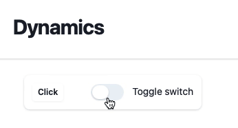
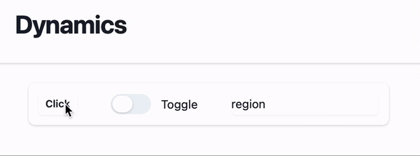
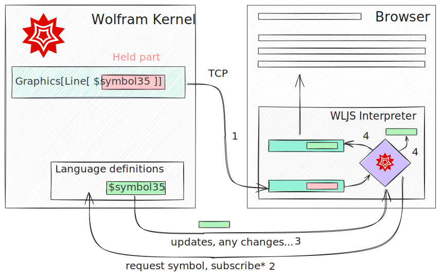
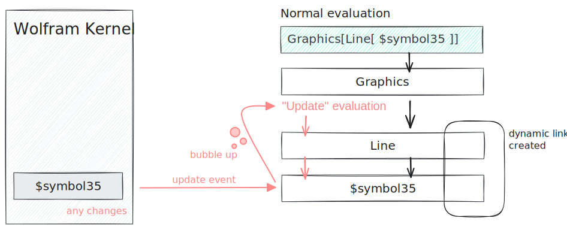
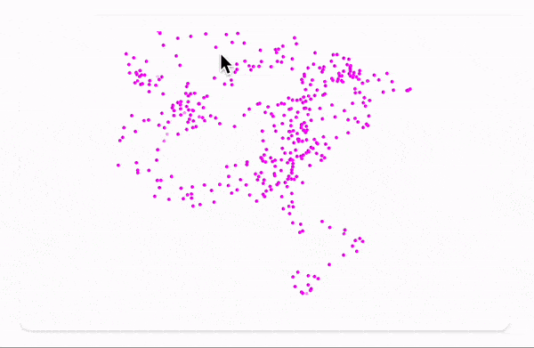

# Dynamics and interactivity


**There is no need in crafting your own API to interact with a working Wolfram Kernel to bring input elements and update the data in real-time**

:::note
It is assumed you have read an [interpeter](WLX/interpeter.md) page first
:::

<details>  
<summary>A shortcut</summary>  
If you have git installed. Simply clone 

```bash
git clone https://github.com/JerryI/wl-wlx
cd wl-wlx
wolframscript -f Examples/WLJSBasicDyn/WLJSBasicDyn.wls
```

that will run the simplest example possible
</details>

## Preparations
We are going to use WebSockets protocol for the real-time communication. for that one need to set up a corresponding server [WebSocketHandler](https://github.com/JerryI/WebSocketHandler) written by Kirill Belov. Please see his repo for more details regarding this server. One need only to set an hostname and port for it and assign it __to a separate TCP server__.

Let us rewrite our wolfram script file

```mathematica
Uncompress["1:eJx1T8tuwjAQDBT1wo0/6Ac0vveKKAoNCJoDZ5NugsXGtrwbBf6edawKLlzG+5rxzMfJ/TZvWZbRVKBomkms5wLfBmF1NcR0qN6lL/fbfMC0j4Q18
PM80mkmcDR8TlexK0Ug7SKnAh5f9F0aRoGi8y5wVUp5Zvb0pVTQQ96KTn/qCULtLIPlvHad2kAIt0IN+Imu1uh1fdEtkOq0seoHggVUydForuJgbJsCLgSWTj7r7d/q6gMQGWfT
Lt7KLPp4ZPq3+qz0Iv6Yddcj3gGoDVPG"];

PacletRepositories[{
  Github -> "https://github.com/KirillBelovTest/Objects",
  Github -> "https://github.com/JerryI/Internal",
  Github -> "https://github.com/JerryI/CSocketListener" -> "dev2024",
  Github -> "https://github.com/JerryI/TCPServer",
  Github -> "https://github.com/JerryI/HTTPHandler",
  { /* highlight-next-line */ }
  Github -> "https://github.com/JerryI/WebSocketHandler",
  Github -> "https://github.com/JerryI/wl-wljs-packages",  
  { /* highlight-next-line */ }
  Github -> "https://github.com/JerryI/wl-misc" -> "dev"
}]

RandomWord[];

{ /* highlight-start */ }
(* Here you can configure *)
ENV = <|
    "WSPort"->8011,
    "HTTPPort"->8010,
    "Host"->"127.0.0.1"
|>

ENV["HAddr"] := StringTemplate["``:``"][ENV["Host"], ENV["HTTPPort"]]
ENV["WAddr"] := StringTemplate["``:``"][ENV["Host"], ENV["WSPort"]]
{ /* highlight-end */ }

(* TCP Server *)
<<KirillBelov`Objects`
<<KirillBelov`Internal`
<<KirillBelov`CSockets`
<<KirillBelov`TCPServer`

(* HTTP services *)
<<KirillBelov`HTTPHandler`
<<KirillBelov`HTTPHandler`Extensions`

(* WS services *)
<<KirillBelov`WebSocketHandler`

(* Event handling and WLJS communication *)
{ /* highlight-start */ }
<<JerryI`Misc`Events`
<<JerryI`Misc`Async`
<<JerryI`Misc`WLJS`Transport`
{ /* highlight-end */ }

<<JerryI`WLX`
<<JerryI`WLX`Imported`
<<JerryI`WLX`WLJS`
```

To handle the connection between WLJS Interpreter and Wolfram Kernel another package [WLJSTransport](https://github.com/JerryI/wl-misc/blob/main/Kernel/WLJSIO.wl) is used. All communication with browser is going to be an event-based. Therefore we need [Events](https://github.com/JerryI/wl-misc/blob/main/Kernel/Events.wl) library, __which is not available @ Wolfram Paclet Repository__ as well as some others library, and can be installed only using [LPM package manager](https://github.com/JerryI/wl-localpackages), since it modifies system functions.

To have a basic GUI elements we use `wljs-inputs` (see [reference](https://jerryi.github.io/wljs-docs/docs/frontend/instruction/#)) library

*code continues*
```mathematica
<<JerryI`WLJSPM`

WLJS`PM`Repositories[{
  Github -> "https://github.com/JerryI/wljs-interpreter" -> "dev",
  Github -> "https://github.com/JerryI/wljs-sharedlib-d3" -> "master",
  Github -> "https://github.com/JerryI/wljs-graphics-d3" -> "dev",
  { /* highlight-next-line */ }
  Github -> "https://github.com/JerryI/wljs-inputs" -> "dev"
}]

(* import libs data *)
Map[Function[path,
    Block[{System`$RemotePackageDirectory = FileNameJoin[{"wljs_packages", FileNameSplit[path] // First}]},
        FileNameJoin[{"wljs_packages", path}] // Get // Quiet;
    ];
], WLJS`PM`Includes["kernel"] ];
```

Now a new TCP server has to be started in our to establish a new type of real-time communication channel

*code continues*
```mathematica
Print["Staring HTTP server..."];

tcp = TCPServer[];
tcp["CompleteHandler", "HTTP"] = HTTPPacketQ -> HTTPPacketLength;
tcp["MessageHandler", "HTTP"] = HTTPPacketQ -> http;

(* our main file for all requests *)
App = ImportComponent["App.wlx"];

http = HTTPHandler[];

http["MessageHandler", "File"]  = GetFileRequestQ[{"css", "js"}] -> (
  ImportFile[#, "Base" -> {"wljs_packages"}] &
)

http["MessageHandler", "Index"] = AssocMatchQ[<|"Method" -> "GET"|>] -> App

SocketListen[CSocketOpen[ENV["HAddr"]], tcp@#&]

Print["Staring WS/HTTP server..."];
{ /* highlight-start */ }
wcp = TCPServer[]
wcp["CompleteHandler", "WebSocket"] = WebSocketPacketQ -> WebSocketPacketLength
wcp["MessageHandler", "WebSocket"]  = WebSocketPacketQ -> ws

ws = WebSocketHandler[]

(* configure the handler for WLJS communications *)
ws["MessageHandler", "Evaluate"]  = Function[True] -> WLJSTransportHandler


SocketListen[CSocketOpen[ENV["WAddr"]], wcp@#&]
{ /* highlight-end */ }

StringTemplate["open http://``"][ENV["HAddr"]] // Print;
While[True, Pause[1]];
```

Now we have finished with minor preparations of server. Let us move on to our App's logic

```jsx title="App.wlx"
{ /* highlight-next-line */ }
Inputs = ImportComponent["Components/Inputs.wlx"];

ExtensionsJS = (StringJoin["", FileNameToURLPath[#]]) &/@ WLJS`PM`Includes["js"];
ExtensionsStyles = With[{Path = StringJoin["", FileNameToURLPath[#]]},
  <link rel="stylesheet" href="{Path}"/> 
] &/@ WLJS`PM`Includes["styles"] // ToStringRiffle;

(* /* HTML Page */ *)

App[request_] := With[{},
    <html> 
        <head>
            <title>WLX Template</title>
            <link href="https://unpkg.com/tailwindcss@^1.0/dist/tailwind.min.css" rel="stylesheet"/>  
            <WLJSHeader List={ExtensionsJS}/> 
            <ExtensionsStyles/>  
            { /* highlight-next-line */ }
    		<WLJSTransportScript Port={ENV["WSPort"]}/>
        </head>  
        <body> 
            <div class="min-h-full">
                <header class="bg-white shadow">
                    <div class="flex items-center mx-auto max-w-7xl px-4 py-6 sm:px-6 lg:px-8">
                        <h1 class="text-3xl font-bold tracking-tight text-gray-900">Dynamics</h1>
                    </div>
                </header>
                <main>
                    <div class="flex col mx-auto max-w-7xl py-6 sm:px-6 lg:px-8">
                        <div class="mx-4 py-3 px-3 col rounded-lg bg-white shadow">
                            { /* highlight-next-line */ }
                            <Inputs Request={request}/>
                        </div>
                    </div>
                </main>
            </div>
        </body>
    </html>
];

App
 ```

The line in the head's section embeds a special header script to establish WebSocket connection. An imported component `Components/Inputs.wlx` is going to be our sandbox for experiments

## Usage
To utilize full power of reactive framework, one need to consider a concept of [Events](Reference/Misc/Events.md) library. The basic idea would be

```jsx title="Components/Inputs.wlx"
Component[OptionsPattern[]] := Module[{Button},
	{ /* highlight-start */ }
    Button = InputButton[];
    EventHandler[Button, Function[Null,
        Print["Pressed!"];
    ]];
    { /* highlight-end */ }

    <div class="flex flex-row gap-x-10">
        <WLJS>
	        { /* highlight-next-line */ }
            <Button/>
        </WLJS>
    </div>
]

Component
```


:::tip
Please consider to have a look at [reference section](https://jerryi.github.io/wljs-docs/docs/frontend/instruction/#) on *wljs-inputs* library.
:::

By pressing a button, one should see messages in the console


There are a couple more input elements, which can be embedded on a page
- `InputText`
- `InputRange`
- `InputFile`
- `InputCheckbox`

More about them one can find [here](https://jerryi.github.io/wljs-docs/docs/frontend/instruction/#) in the reference section. However, you don't have to limit yourself with prebuilt blocks. One can always craft your own UI components using WLX

### Crafting UI components
Let us create a new component called `Toggle.wlx` in the project's `Components` folder. The easiest way is to pick up one of Tailwind's component and add necessary logic to it

```jsx title="Components/Toggle.wlx"
Component[OptionsPattern[]] := With[{
    Dom = CreateUUID[], 
    Label = OptionValue["Label"], 
    Event = OptionValue["Event"],
    State = OptionValue["State"],
    ButtonClass = If[OptionValue["State"], "bg-wlx-500", ""],
    SpanClass   = If[OptionValue["State"], "translate-x-5", ""]
},
    <div class="flex items-center">
        <style>
            .bg-wlx-500 {
                background-color: #2dd4bf;
            }
        </style>
        <button id="{Dom}" type="button" class="bg-gray-200 relative inline-flex h-6 w-12 flex-shrink-0 cursor-pointer rounded-full border-2 border-transparent transition-colors duration-200 ease-in-out focus:outline-none focus:ring-2 focus:ring-indigo-600 focus:ring-offset-2 {ButtonClass}" role="switch">
            <span state="{State}" aria-hidden="true" class="translate-x-0 pointer-events-none inline-block h-5 w-6 transform rounded-full bg-white shadow ring-0 transition duration-200 ease-in-out {SpanClass}"></span>
        </button>
        <span class="ml-3 text-sm">
            <span class="mb-1 text-gray-900"><Label/></span>
        </span>
        <script type="module">
            const button = document.getElementById("<Dom/>");
            const span = button.firstChild;
            let state = span.getAttribute('state') == 'True';
            button.addEventListener("click", () => {
                button.classList.toggle("bg-wlx-500");
                span.classList.toggle("translate-x-5");
                state = ~state;
                server.kernel.emitt("<Event/>", state ? 'True' : 'False')
            })
        </script>
    </div>
]

Options[Component] = {"State" -> False, "Label" -> "Toggle", "Event" -> Null}

Component
```
Here a component comes with its supporting Javascript code, that sends events to a server. Let us have a look closely

```js
button.addEventListener("click", () => {
	//animation
    button.classList.toggle("bg-wlx-500");
    span.classList.toggle("translate-x-5");
    //internal state for animation
    state = ~state;
    //send a new state to a server
    server.kernel.emitt("<Event/>", state ? 'True' : 'False')
})
```

The last line is the most important, it uses API from [`WLJSTransport`](Reference/Misc/WLJSTransport.md#`server`), that exposes `server` object, which has a method for us 

```js
.emitt(event_uid, data)
```

Then we can capture those events on a server. Let us add it to our *previous example*

```jsx title="Components/Inputs.wlx"
{ /* highlight-start */ }
Toggle = ImportComponent["Toggle.wlx"];
sharedState = False;
{ /* highlight-end */ }

Component[OptionsPattern[]] := Module[{
    Button
},
    With[{
	    { /* highlight-next-line */ }
        toggle = CreateUUID[]
    },
		{ /* highlight-start */ }
        EventHandler[toggle, Function[state,
            sharedState = state;   
        ]];
        { /* highlight-end */ }

        Button = InputButton[];
        EventHandler[Button, Function[Null,
            Print["Pressed!"];
        ]];

        <div class="flex flex-row gap-x-10">
            <WLJS>
                <Button/>
            </WLJS>
            { /* highlight-next-line */ }
            <Toggle Event={toggle} State={sharedState}/>
        </div>
    ]
]

Component
 ```

As one can see, now we update `sharedState`, which is global across all connections. If one reloads a page, the position of a toggle switch will be preserved.

The desired result should look like this



This is a great start, but still haven't tried to change anything on a page!

## Call actions on a page
To manipulate DOM elements or call an arbitrary Javascript code from the server, we can use the same Wolfram Language expressions. For example lets attach a call to one of our buttons

```mathematica title="Components/Inputs.wlx"
...

Button = InputButton[];
EventHandler[Button, Function[Null,
    Print["Pressed!"];
	{ /* highlight-next-line */ }
	WLJSTransportSend[Alert["Pressed!"], $Client]
]];

...
```

`Alert` is a built-in function defined in [WLJS Interpreter](https://jerryi.github.io/wljs-docs/docs/interpreter/intro). A window will pop up on a page, once first button is pressed.

### DOM Manipulation
To manipulate DOM we need to write a WL function for it in Javascript. For example, let it be a text field

```html
<input type="text" id="text" class="block w-full rounded-md border-0 py-1.5 text-gray-900 shadow-sm ring-1 ring-inset ring-gray-300 placeholder:text-gray-400 focus:ring-2 focus:ring-inset focus:ring-indigo-600 sm:text-sm sm:leading-6"/>
```

then using Javascript, we can access this element on a page and change its content

```js
const element = document.getElementById('text');
core.UpdateText = async (args, env) => {
	element.value = await interpretate(args[0], env);
}
```

From server's side we directly call this function as

```mathematica
WLJSTransportSend[UpdateText[RandomWord[]], $Client]
```

Wrapping it all, we can modify our code as follows

```jsx title="Components/Inputs.wlx"
Toggle = ImportComponent["Toggle.wlx"];

sharedState = False;

{ /* highlight-start */ }
TextDisplay = With[{},
    <input type="text" id="text" class="block w-full rounded-md border-0 py-1.5 text-gray-900 shadow-sm ring-1 ring-inset ring-gray-300 placeholder:text-gray-400 focus:ring-2 focus:ring-inset focus:ring-indigo-600 sm:text-sm sm:leading-6"/>
    <script type="module">
        const element = document.getElementById('text');
        core.UpdateText = async (args, env) => {
            element.value = await interpretate(args[0], env);
        }
    </script>
]
{ /* highlight-end */ }

Component[OptionsPattern[]] := Module[{
    Button
},
    With[{
        toggle = CreateUUID[]
    },

        EventHandler[toggle, Function[state,
            sharedState = state;   
        ]];

        Button = InputButton[];
        EventHandler[Button, Function[Null,
            Print["Pressed!"];
            { /* highlight-next-line */ }
            WLJSTransportSend[UpdateText[RandomWord[]], $Client];
        ]];

        <div class="flex flex-row gap-x-10">
            <WLJS>
                <Button/>
            </WLJS>
            <Toggle Event={toggle} State={sharedState}/>
            { /* highlight-next-line */ }
            <TextDisplay/>
        </div>
    ]
]

Component
```

The desired result is quite predictable



:::tip
Write building blocks for each section or element of UI and arrange them using solely WLX and Event system. Try to avoid using Javascript outside those components.
:::

:::tip
Try [WebUI](WLX/WebUI%20Library/intro.md) framework if you prefer write less Javascript code
:::

## Dynamic symbols
This is completely independent and different approach to update data on a page, which is based on Wolfram Language symbols and lexical scoping.

The idea arises from a problem of synchronization between WL symbols on browser's and server's sites. By the default an unknown for WLJS Interpreter symbols is requested and later tracked, i.e. all changes of it on a server will be sent to an associated client



Moreover such symbols has special attribute and can be seen from nested expressions by WL interpreter and on each change the connected branch will be reevaluated on your browser. It allows to improve the performance, since only reevaluation of dependent parts happens with no communication to a Wolfram Kernel at all



And lastly, during partial reevaluation involved expressions are executed using different methods, which are highly optimized, i.e.

```js
core.Expression = async (args, env) => {
	//initialization and etc
	...
	//do some complicated work
}

core.Expression.update = async (args, env) => {
	...
	//do something more simplifed
}
```

:::info
More about an architecture one can read in [this guide](https://jerryi.github.io/wljs-docs/docs/interpreter/Advanced/architecture).
:::

:::warning
Not all defined functions in WLJS Interpreter support such methods. Please see the [reference](https://jerryi.github.io/wljs-docs/docs/frontend/instruction) section. 
:::

Luckily most case scenarios for graphics are covered, especially `Line`, `Point` and other  primitives.

### Preparations
In order to support this a few tweaks has to be done with [WLJSTransport](Reference/Misc/WLJSTransport.md). Please modify your server script as follows

```mathematica
ws = WebSocketHandler[]

(* configure the handler for WLJS communications *)
ws["MessageHandler", "Evaluate"]  = Function[True] -> WLJSTransportHandler

{ /* highlight-start */ }
(* symbols tracking *)
WLJSTransportHandler["AddTracking"] = Function[{symbol, name, cli, callback},
    Print["Add tracking... for "<>name];
    Experimental`ValueFunction[Unevaluated[symbol]] = Function[{y,x}, callback[cli, x]];
, HoldFirst]

WLJSTransportHandler["GetSymbol"] = Function[{expr, client, callback},
    Print["Evaluating the desired symbol on the Kernel"];
    callback[expr // ReleaseHold];
]
{ /* highlight-end */ }
```

It stands for resolving requests for such symbols from browser's side and tracking their changes. That's basically all when it comes to setting it up.

Let's add a new component to our example

```jsx title="App.wlx"
Inputs  = ImportComponent["Components/Inputs.wlx"];
{ /* highlight-next-line */ }
Symbols = ImportComponent["Components/Symbols.wlx"];

ExtensionsJS = (StringJoin["", FileNameToURLPath[#]]) &/@ WLJS`PM`Includes["js"];
ExtensionsStyles = With[{Path = StringJoin["", FileNameToURLPath[#]]},
  <link rel="stylesheet" href="{Path}"/> 
] &/@ WLJS`PM`Includes["styles"] // ToStringRiffle;

(* /* HTML Page */ *)

App[request_] := With[{},
    <html> 
        <head>
            <title>WLX Template</title>
            <link href="https://unpkg.com/tailwindcss@^1.0/dist/tailwind.min.css" rel="stylesheet"/>  
            <WLJSHeader List={ExtensionsJS}/> 
            <ExtensionsStyles/>  
    		<WLJSTransportScript Port={ENV["WSPort"]}/>
        </head>  
        <body> 
            <div class="min-h-full">
                <header class="bg-white shadow">
                    <div class="flex items-center mx-auto max-w-7xl px-4 py-6 sm:px-6 lg:px-8">
                        <h1 class="text-3xl font-bold tracking-tight text-gray-900">Dynamics</h1>
                    </div>
                </header>
                <main>
                    <div class="flex col mx-auto max-w-7xl py-6 sm:px-6 lg:px-8">
                        <div class="mx-4 py-3 px-3 col rounded-lg bg-white shadow">
                            <Inputs Request={request}/>
                        </div>
                        <div class="mx-4 py-3 px-3 col rounded-lg bg-white shadow">
                            { /* highlight-next-line */ }
                            <Symbols Request={request}/>
                        </div>
                    </div>
                </main>
            </div>
        </body>
    </html>
];

App
```

Now an actual example 

### Usage
The binding between Wolfram Kernel symbols and variables located at your browser is done automatically if it is wrapped using `Offload` expression

```jsx title="Components/Symbols.wlx"
Component[OptionsPattern[]] := Module[{
    p = {{0,0}},
    Canvas,
    task
},
    Canvas = Graphics[{
        Magenta, Point[Offload[p]]
    },  PlotRange->{{-1,1},{-1,1}}, 
        TransitionDuration->100, 
        TransitionType->"Linear"
    ];

    task = SetInterval[
        p = Append[p, Last[p] + 0.1 RandomReal[{-1,1},2]];
    , 100];

    <WLJS>
        <Canvas/>
    </WLJS>
]

Component
```

Here a typical `Graphics` expression is used, however, a symbols with points inside `pts` is wrapped in `Offload`, that leaves an inner symbol unevaluated. Then every `100~ms` an asynchronous task appends new points to it.

:::info
`SetInterval` is a shortcut for `SchelduledTask` from [Async](Reference/Misc/Async.md) package.
:::

The result is following




:::note
This canvas and its points are unique for each connected client or window.
:::

:::caution
You should detect a closed connection in order to remove symbols, tasks or other objects which load the main kernel. Please see the next section.
:::

## Binding to the connection state
In the example above every request causes `SetInterval` to be evaluated, but it is good to have a method to detect if a client closed a window and abort the task or collect garbage.

### Preparations
Modify the main script as follows

```mathematica
...

(* Event handling and WLJS communication *)
<<JerryI`Misc`Events`
{ /* highlight-next-line */ }
<<KirillBelov`CSockets`EventsExtension`
<<JerryI`Misc`WLJS`Transport`
<<JerryI`Misc`Async`

...

{ /* highlight-next-line */ }
SocketListen[CSocketOpen[ENV["WAddr"]], wcp@#&, "SocketEventsHandler"->CSocketsClosingHandler]
```

This will redirect all events regarding the socket state to a special handler function `CSocketsClosingHandler`, which redirects them to [Events](Reference/Misc/Events.md) system.

Now for each [`$Client`](Reference/Misc/WLJSTransport.md#`$Client`) we can attach an [`EventHandler`](Reference/Misc/Events.md#`EventHandler`) and check if it is alive or not. For the convenience we can do it globally for the whole App. Let us add a few more line 

```jsx title="App.wlx"
Inputs  = ImportComponent["Components/Inputs.wlx"];
Symbols = ImportComponent["Components/Symbols.wlx"];

ExtensionsJS = (StringJoin["", FileNameToURLPath[#]]) &/@ WLJS`PM`Includes["js"];
ExtensionsStyles = With[{Path = StringJoin["", FileNameToURLPath[#]]},
  <link rel="stylesheet" href="{Path}"/> 
] &/@ WLJS`PM`Includes["styles"] // ToStringRiffle;

(* /* HTML Page */ *)

App[request_] := With[{
	{ /* highlight-next-line */ }
    Session = CreateUUID[],
    { /* highlight-next-line */ }
    Controls = CreateUUID[]
},

	{ /* highlight-start */ }
    EventHandler[Session, {"Connected" -> Function[Null,
        Echo["Connected!"];
        With[{socket = $Client},
            EventHandler[socket, {"Closed" -> Function[Null,
                EventFire[Controls, "Destroy", True];
            ]}];
        ]
    ]}];
    { /* highlight-end */ }

    <html> 
        <head>
            <title>WLX Template</title>
            <link href="https://unpkg.com/tailwindcss@^1.0/dist/tailwind.min.css" rel="stylesheet"/>  
            <WLJSHeader List={ExtensionsJS}/> 
            <ExtensionsStyles/> 
            { /* highlight-next-line */ } 
    		<WLJSTransportScript Port={ENV["WSPort"]} Event={Session}/>
        </head>  
        <body> 
            <div class="min-h-full">
                <header class="bg-white shadow">
                    <div class="flex items-center mx-auto max-w-7xl px-4 py-6 sm:px-6 lg:px-8">
                        <h1 class="text-3xl font-bold tracking-tight text-gray-900">Dynamics</h1>
                    </div>
                </header>
                <main>
                    <div class="flex col mx-auto max-w-7xl py-6 sm:px-6 lg:px-8">
                        <div class="mx-4 py-3 px-3 col rounded-lg bg-white shadow">
                            { /* highlight-next-line */ }
                            <Inputs Controls={Controls} Request={request}/>
                        </div>
                        <div class="mx-4 py-3 px-3 col rounded-lg bg-white shadow">
                            { /* highlight-next-line */ }
                            <Symbols Controls={Controls} Request={request}/>
                        </div>
                    </div>
                </main>
            </div>
        </body>
    </html>
];

App
```

A provided `Event` option value of [`WLJSTransportScript`](Reference/Misc/WLJSTransport.md#`WLJSTransportScript`) fires an event `"Connected"`, where we can capture an identifier of connected client and subscribe for connection state. Once `"Closed"` has been captured, we fire a global `"Destroy"` event on `Controls`. The last one is distributed over all used components using XML attributes as shown above.

Now it is possible to cancel a running task in [section above](#Usage) by subscribing to `"Destroy"` event

```jsx title="Component/Symbols.wlx"
Component[OptionsPattern[]] := Module[{
    p = {{0.,0.}},
    Canvas,
    task,
    controls = EventClone @ OptionValue["Controls"]
},
    EventHandler[controls, {"Destroy" -> Function[Null,
        Echo["Destroyed!"];
        TaskRemove[task];
    ]}];

    Canvas = Graphics[{
        Magenta, Point[Offload[p]]
    },  PlotRange->{{-1,1},{-1,1}}, 
        TransitionDuration->100, 
        TransitionType->"Linear"
    ];

    task = SetInterval[
        p = Append[p, Last[p] + 0.1 RandomReal[{-1,1},2]];
    , 100];

    <WLJS>
        <Canvas/>
    </WLJS>
]

Component
```


