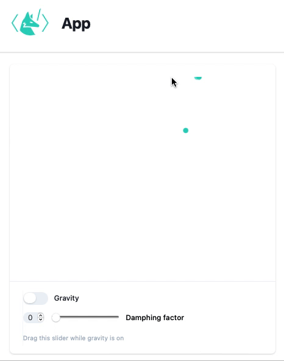

# Bouncing balls


A bouncing balls simulation, that runs in real-time and uses user's mouse to add balls to the simulation.

:::info
It is assumed that you have cloned git repository with examples. If not

```bash
git clone https://github.com/JerryI/wl-wlx
cd wl-wlx
```
:::

## Action
To get the most of your attention I (@JerryI - maintainer) would like to start with a short demo of this application



*a time jitter is due to the recordings issues*

To run this demo 
```bash
wolframscript -f Examples/Balls/Balls.wls
```

## Description

The first example uses HTTP and WS servers and dynamic mode of WLJS Interpreter. The project structure is following

```project
Balls/	       			public directory
	Components/
		Head.wlx		header component
		Logo.wlx		logo of WLX in svg
		Toggle.wlx		a custom toggle button component
		UI.wlx			UI layout of an app
		
	App.wlx				actual application file with code and logic
	Main.wlx			entry point of any request to an app
	Balls.wls 			main startup file
```

This example widely uses event handling and dynamic symbols we talked about in [dynamics](WLX/dynamics.md) section. 

Let us have a look at the `Main.wlx`, which is an entry-point of our requests from client
```mathematica title="Main.wlx"
(* /* importing dynamic components */ *)

Head       := ImportComponent["Components/Head.wlx"];
Logo       := ImportComponent["Components/Logo.wlx"];
App         = ImportComponent["App.wlx"];

(* /* HTML Page */ *)
ExtensionsJS = (StringJoin["/", FileNameToURLPath[#]]) &/@ WLJS`PM`Includes["js"];
ExtensionsStyles = With[{Path = FileNameToURLPath[#]},
  <link rel="stylesheet" href="/{Path}"/> 
] &/@ WLJS`PM`Includes["styles"] // ToStringRiffle;

Main[request_] := With[{
    session = CreateUUID[],
    controls = CreateUUID[]
},

	{ /* highlight-start */ }
    EventHandler[session, {"Connected" -> Function[Null,
        Echo["Connected!"];
        
        With[{socket = $Client},
            EventHandler[socket, {"Closed" -> Function[Null,
                Echo["Closed!!!"];
                EventFire[controls, "Destroy", True];
            ]}];
        ]
    ]}];
    { /* highlight-end */ }

    <html> 
        <Head>
            <WLJSHeader List={ExtensionsJS}/>     
            <ExtensionsStyles/>
            <WLJSTransportScript Port={ENV["WSPort"]} Event={session}/>
        </Head>  
        <body> 
            <div class="min-h-full">
                <header class="bg-white shadow">
                    <div class="flex items-center mx-auto max-w-7xl px-4 py-6 sm:px-6 lg:px-8">
                        <Logo Width={"5em"}/>
                        <h1 class="text-3xl px-5 font-bold tracking-tight text-gray-900">App</h1>
                    </div> 

                </header>
                <main>
                    <div class="mx-auto max-w-7xl py-6 sm:px-6 lg:px-8">
	                    { /* highlight-next-line */ }
                        <App Controls={controls}/>
                    </div>
                </main>
            </div>
        </body>
    </html>
]

Main
```

Here it subscribes for `"Closed"` event from connected socket and causes a global `"Destroy"` event for `App.wlx`. Therefore we can cancel created tasks, remove listeners once connection is lost.

In the main application file, things get more interesting

```jsx title="App.wlx"
(* /* ------------------------------------------------------------ */ *)
(* /* Functions, which are global for all instances of a component */ *)
 
append[xy_, pos_, vel_] := With[{}, 
   If[Length[arr] > 100,
      pos = Append[Drop[pos, 50], xy]; vel = Append[Drop[vel, 50], RandomReal[]/5.0];
   ,
      pos = Append[pos, xy]; vel = Append[vel, RandomReal[]/5.0];
   ];
]; 

SetAttributes[append, HoldRest];

(* /* kinda many bodies sim in real time */ *)
manyBodySim[pos_, vels_, damphing_] := Module[{newState = pos},
   pos = MapIndexed[With[{i = #2[[1]], y = #1[[2]]},
      vels[[i]] = (1.0 - damphing / 10.0) vels[[i]] - Sign[y] 0.1;
      With[{calculated = y + vels[[i]] 0.1},
         (* /* bounce back if hit the ground */ *)
         If[Sign[y] (calculated) < 0, 
            vels[[i]] = - vels[[i]];
            {#1[[1]], Sign[y] 0.001}
         ,
            {#1[[1]], calculated}
         ]
      ]


   ]&, newState];
];

SetAttributes[manyBodySim, HoldAll]

(* /* Create an instance of widget */ *)

create[globalControls_, localControls_] := Module[{
   dots = {{0.,0.5}},
   vels = {0.},
   damping = 0.,
   task = Null,

   listener
},

   (*/* mouse position listener */*)
   listener = {White, EventHandler[Rectangle[{-10, -10}, {10,10}], {"mousemove"->Function[xy, append[xy, dots, vels]]}]};

   (*/* handling events from UI buttons */*)
   EventHandler[localControls, {
      "Gravity" -> Function[switch,
         If[switch,
            Echo["Task started"];
            task = SetInterval[manyBodySim[dots, vels, damping], 1000/30.];
         ,
            Echo["Task ended"];
            TaskRemove[task];
         ]
      ],

      "Damping" -> Function[value, damping = value]
   }];

   (*/* handling global events */*)
   EventHandler[globalControls, {"Destroy" -> Function[Null,
      Echo["Widget removed!"];
      Echo["Task ended"];
      TaskRemove[task];
   ]}];

   (*/* a an output for WLJS Interpreter */*)
   Graphics[{
      listener, 
      RGBColor[0.1764, 0.8313, 0.74901], PointSize[0.05], Point[Offload[dots]]
   }, Controls->True, TransitionDuration->50, PlotRange->{{-1,1}, {-1,1}}]
];


(* /* UI components for controls of simulation */ *)
UI := ImportComponent["Components/UI.wlx"];

(* /* ------------------------------------------------------------ */ *)
(* /* For each request an App function is called */ *)
App[OptionsPattern[]] := With[{
   globalControls = OptionValue["Controls"],
   localControls  = CreateUUID[]
},
   With[{
      PlottingDevice = create[globalControls, localControls]
   },

      <div class="divide-y divide-gray-200 max-w-lg overflow-hidden rounded-lg bg-white shadow">
        <div class="px-4 py-5 sm:p-6">
         <WLJS>
            <PlottingDevice/> 
         </WLJS>
        </div>
        <div class="px-4 py-4 sm:px-6">
            <UI Event={localControls}/>
        </div>
      </div>
   ]
]

App
```


The interesting thing here __is a mouse listener__, that works purely on WLJS Interpreter

```mathematica title="app.wlx"
listener = {White, EventHandler[Rectangle[{-10, -10}, {10,10}], {"mousemove"->Function[xy, append[xy, dots, vels]]}]};
```

This is a giant rectangle, on which an `EventHandler` was attached, then each time you move your mouse it fires `append` function on a server.

Once this toggle switch is pressed
```jsx title="Components/UI.wlx"
Event = $Options["Event"];

(* /* custom built UI component */ *)
ToggleView := ImportComponent["Toggle.wlx"];

gravity = CreateUUID[];

EventHandler[gravity, Function[switch,
   EventFire[Event, "Gravity", switch];
]];

(* /* a regular component from wljs-inputs lib. */ *)
SliderControl = InputRange[0, 1, 0.1, 0, "Label"->"Damping"];

EventHandler[SliderControl, Function[value,
   EventFire[Event, "Damping", value];
]];


<ul role="list" class="divide-x divide-gray-100">
    <li class="flex justify-between gap-x-6 py-1">
       <div class="flex min-w-0 gap-x-4">
          <div class="min-w-0 flex-auto">   
            { /* highlight-next-line */ } 
            <ToggleView Event={gravity} Label={"Gravity"}/>
          </div>
       </div>
    </li>

    <li class="flex justify-between gap-x-6 py-1">
       <div class="flex min-w-0 gap-x-4">
          <div class="min-w-0 flex-auto">
             <p class="text-sm font-semibold leading-6 text-gray-900">
                <WLJS>
                    <SliderControl/>
                </WLJS>
             </p>
             <p class="mt-1 truncate text-xs leading-5 text-gray-500">Drag this slider while gravity is on</p>
          </div>
       </div>
    </li>
</ul>
```

It fires this event handler

```jsx title="App.wlx"
   EventHandler[localControls, {
   { /* highlight-next-line */ } 
      "Gravity" -> Function[switch,
         If[switch,
            Echo["Task started"];
            task = SetInterval[manyBodySim[dots, vels, damping], 1000/30.];
         ,
            Echo["Task ended"];
            TaskRemove[task];
         ]
      ],

      "Damping" -> Function[value, damping = value]
   }];
   ```

which starts a task (scoped for each instance of an App), that performs calculations of dot's coordinates and velocities in a gravity field.