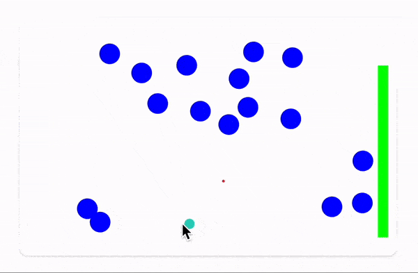

# Asteroids
A __multiplayer game__ with projectiles and primitive enemies. This is an extreme case of [Dynamic symbols](WLX/dynamics.md#Dynamic%20symbols) usage. All particles are calculated on server and then, broadcasted every `1/30` sec. for all connected clients. 



To run this demo 

```bash
git clone https://github.com/JerryI/wl-wlx
cd wl-wlx
wolframscript -f Examples/Asteroids/Asteroids.wls
```

All players connection are managed by events system and a global event object `"game"`

```mathematica
players = <||>;
EventHandler["game", {
   "Add player" -> Function[data,
      Echo["Add player from socket"];
      With[{cli = data["Client"]},
         players[cli] = data;
      ]
   ],

   "Remove player" -> Function[data,
      Echo["Remove player"];
      With[{cli = data["Client"]},
         players[cli] = .;
      ]
   ],

   _ -> Null
}];
```
## App instances
For each window a separate instance of app is generated

```jsx
App[OptionsPattern[]] := With[{
   globalControls = OptionValue["Controls"],
   localControls  = CreateUUID[]
},
   With[{
      PlottingDevice = create[globalControls]
   },

      <div class="divide-y divide-gray-200 max-w-lg overflow-hidden rounded-lg bg-white shadow">
        <div class="px-2 py-2">
         <WLJS>
            <PlottingDevice/> 
         </WLJS>
        </div>
      </div>
   ]
]
```

where `create` allocates symbols for players targets, life meter and etc...

```mathematica
create[controls_] := Module[{
   target = {0,-1},
   life = 2.,
   score = 0,
   listener,
   enemies = {},
   projectiles = {},
   positions = {},
   gameEvents,
   delay = 5
},

   gameEvents = EventClone["game"];
   EventHandler[controls, {
      "Destroy" -> Function[cli,
         Echo["Widget removed!"];
         EventFire["game", "Remove player", <|"Client"->cli|>];
         EventRemove[gameEvents];
         checkTask;
      ],

      "Connected" -> Function[cli,
         EventHandler[gameEvents, {
            UpdatePositions -> Function[Null,
               positions = #["Target"] &/@ Values[players];
            ],

            UpdateProjectiles -> Function[Null,
               projectiles = proximitySort[projectiles, #[[1]] &/@ globalProjectiles];
            ],

            UpdateEnemies -> Function[Null,
               enemies = proximitySort[enemies, #[[1]] &/@ globalEnemies];
               If[life < 0, 
                  Close[cli];
               ];
            ]
         }];

         EventFire["game", "Add player", <|"Client"->cli, "Target":>target, "Life":>life|>];
         checkTask;
      ]
   }]; 


   listener = {White, EventHandler[Rectangle[{-10, -10}, {10,10}], {
      "mousemove"->Function[xy, 
         target = xy;
         EventFire["game", UpdatePositions, Null];
         delay -= 1;
         If[delay < 0,
            globalProjectiles = Append[globalProjectiles,  Projectile[xy + {0, 0.05}, {RandomReal[{-0.03,0.03}], 0.15}, 2]];
            delay = 4;
         ];
      ]
   }]};


   Graphics[{
      listener, 
      {Green, Rectangle[{1,-1}, {1.1, Offload[life] - 1}]},
      {Blue, PointSize[0.1], Point @ Offload @ enemies},
      RGBColor[1.0 - 0.1764, 1.0 - 0.8313, 1.0 - 0.74901], Point[Offload @ projectiles],
      RGBColor[0.1764, 0.8313, 0.74901], PointSize[0.05], Point[Offload @ positions]
   }, TransitionDuration->1, TransitionType->"Linear", PlotRange->{{-1,1}, {-1,1}}]
];
```

Players position is stored in `target` symbol, which is shared with a global variable `players` using global event `"New player"`. On every change a global event with a topic (or pattern) `UpdatePositions` is fired, that forces all connected player to reload the positions of all connected players. The current client is also subscribed to the same global event.

For depicting enemies, projectiles and all players [Dynamic symbols](WLX/dynamics.md#Dynamic%20symbols) are used. However, there is a limitation, that for one symbol only one subscribed client is allowed. Therefore, for each client a local symbols such as `enemies`, `projectiles` and `positions` are allocated, to which all data is transferred once an update has been fired.

### Limitations of graphical output
There is a limitation in this implementation, that all local symbols for moving objects are arrays and are plotted in a very primitive way as

```mathematica
{Blue, PointSize[0.1], Point @ Offload @ enemies},...
```
Since `enemies` length is a variable, it can extend and shrink its size based on number of alive enemies. This leads to a problem, that graphics library draw them as SVG objects. Then when a new enemy added or removed, it does not know, which one is which and just adds or removes the last one, while the all previous are considered to be the same with a new position read from a new array. It leads to serious problems if interpolation is used, i.e. when order of enemies is shifted in an array, all SVG objects jump and flicker. This is a reason, why `TransitionDuration` is set to 1, to get rid of interpolation mostly.

__A better approach__ would be to threat them as individual graphics object on server as well. And dynamically add or remove them from the screen. __So far this feature is still in development__, but on can still use available methods of such as [Call actions on a page](WLX/dynamics.md#Call%20actions%20on%20a%20page) to assign Javascript function to it.

## Server's cycle
Here is is rather simple, there is a single continuous async task running in the background

```mathematica
calculate := (
   time += 0.1;
   calculateProjectile[];
   calculateEnemies[];
   spawnEnemies[];
)
```

for each calculation cycle it fires a global event

```mathematica
globalEnemies = {};
calculateEnemies[] := With[{},
   globalEnemies = calculateEnemies /@ globalEnemies;
   EventFire["game", UpdateEnemies, Null];
]
```
