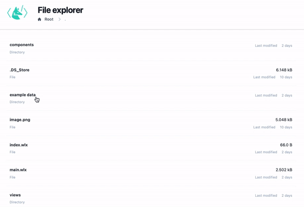

# File explorer & Plotter
This is an __example of a static App__, where there is no live connection to Kernel involved, it is close to somewhat typical PHP website.

A file browser that can plot `.dat` files, display pictures, show text-files and list and navigate directories on your disk.

:::info
It is assumed that you have cloned git repository with examples. If not

```bash
git clone https://github.com/JerryI/wl-wlx
cd wl-wlx
```
:::

## Action
To get the most of your attention we would like to start with a short demo of this application



To run this demo 
```bash
wolframscript -f Examples/Explorer/Explorer.wls
```

## Description

The first example uses only HTTP server and static mode of WLJS Interpreter. The project structure is following

```project
Explorer/				public directory
	Views/
		None.wlx		representation of non-existing file
		Image.wlx		display an image
		Editor.wlx		display a plain text
		Plot.wlx		plot any data
		Directory.wlx	show directory list
	Components/
		Head.wlx		header component
		Logo.wlx		logo of WLX in svg
		Label.wlx		wrapper for labels
		Breadcrumbs.wlx	displays path in a nav bar
		List.wlx		forms a list of items
	example data/		directory with example data to open
	App.wlx			    main layout of an app
	Explorer.wls 			main startup file
```

A file explorer takes a path provided in URL and use it relatively to the `Explorer` folder to depict the content

```mathematica title="Explorer.wls"
...
App = ImportComponent["App.wlx"];
FileRequestQ[request_] := (!MissingQ[request["Query"]["file"]])

http = HTTPHandler[];

http["MessageHandler", "File"] = FileRequestQ -> ImportFile
http["MessageHandler", "Index"] = AssocMatchQ[<|"Method" -> "GET"|>] -> App
...
```

It is quite funny way of using URLs, since usually the path is provided by a parameter, but not as an actual url relative to the hostname. To get the "real" file it uses a bypass provided by `FileRequestQ`, that check if `file=true` parameter is presented.

Any other URLs are passed to  `App.wlx`, where it check the content and then chooses the corresponding view-component to display the data

```mathematica title="App.wlx"
dir        := ImportComponent["Views/Directory.wlx"];
editor     := ImportComponent["Views/Editor.wlx"];
image      := ImportComponent["Views/Image.wlx"];
plot       := ImportComponent["Views/Plot.wlx"];
none       := ImportComponent["Views/None.wlx"];

Breadcrumbs := ImportComponent["Components/Breadcrumbs.wlx"];

(* /* view router */ *)

Unprotect[ImageQ]

ImageQ[path_String]    := FileExistsQ[path] && StringMatchQ[path, RegularExpression[".*\\.(png|jpg|svg|bmp|jpeg)$"]]

DatQ[path_String]      := FileExistsQ[path] && StringMatchQ[path, RegularExpression[".*\\.(dat|csv)$"]]

AnyQ[path_String]      := FileExistsQ[path]

View[path_?DirectoryQ] := (Print["Directory!"];     dir[path]   ); 
View[path_?ImageQ]     := (Print["Image!"];         image[path] );
View[path_?DatQ]       := (Print["Data!"];          plot[path]  );
View[path_?AnyQ]       := (Print["Editor!"];        editor[path]);
View[path_]            := (Print["None!"];          none[path]  );
...
```

For example a viewer for images looks like this

```jsx title="Views/Image.wlx"
URL = URLBuild[<|"Path" -> FileNameSplit[$FirstChild], "Query" -> <|"file" -> True|>|>];

<figure class="max-w-lg bg-gray-100">
  
</figure>
```

Easy, ha?

To plot something it is also quite intuitive - import the data and plot using WLJS
```jsx title="Views/Plot.wlx"
Data = Drop[Import[$FirstChild, "TSV"], 3];

PlottingDevice = With[{p = ListLinePlot[Data, PlotRange->Full, ImageSize->700]},
    Insert[p, Controls->True, {2,-1}]
];

<figure style="display: inline-block">
    <WLJS Class={"h-auto max-w-full flex rounded-lg p-3 bg-gray-100"}>
        <PlottingDevice/>
    </WLJS>
    <figcaption class="text-center gap-x-4 min-w-0 mt-1 text-xs leading-5 text-gray-500">Drag - pan, wheel - zoom</figcaption>
</figure>
```

There is an abstraction `PlottingDevice` used for injecting an option `Controls`, that allows `Graphics` object use mouse to zoom and pan the graph (options of the standard `ListLinePlot` are protected by Wolfram Research ☹️ ). 