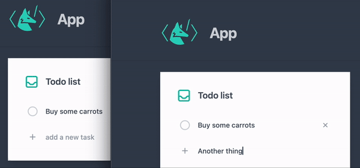

# Todo list
An example of __dynamic multi-user application__ built using most features of [WebUI](Reference/WLX/WebUI.md) framework and [Events](Reference/Misc/Events.md) system



There are two versions of this implementation

## Approach 1
To run this demo 

```bash
git clone https://github.com/JerryI/wl-wlx
cd wl-wlx
wolframscript -f Examples/WebUITodo/Server.wls
```
All notes are stored a basic association with two fields inside `Checked` and `Content`. This is how an instance of `App` looks like

```jsx
App[OptionsPattern[]] := With[{
    controls = CreateUUID[],
    listController = CreateUUID[]
},
Module[{
    typed = ""
},

    EventHandler[controls, {
        "Loaded" -> Function[Null,
            attachListeners[$Client, controls]
        ],

        "New" -> Function[Null,
            With[{uid = CreateUUID[]},
                NotesDatabase[uid] = <|"Content" -> typed, "Checked" -> False|>;
                typed = "";
                EventFire[AppState, RecordChange[], Null];
            ];
        ],

        "Type" -> Function[data,
            Echo[data];
            typed = data;
        ]
    }];


    <div class="flex items-center justify-center font-medium">
    	<div class="flex flex-grow items-center justify-center h-full text-gray-600 bg-gray-100">
    		<div class="max-w-full p-8 bg-white rounded-lg shadow-lg w-96">
                <Header/>
                <WebUIRefresh Event={controls}>
                    <NotesList Database={NotesDatabase} OnUpdate={updateNote}/>
                </WebUIRefresh>
                <AddButton Event={controls}/>
            </div>
            <WebUIOnLoad Event={controls} Pattern={"Loaded"}/>
        </div>
    </div>
] ]

App
```
For each request, an app instance is generated. Of course control buttons are scoped within the instance. First thing that happens - a static view of `NoteList` is rendered on a server inside a refreshable component [`WebUIRefresh`](Reference/WLX/WebUI.md#`WebUIRefresh`). 

Then once a connection is established using `WebUIOnLoad` an instance subscribes for  local events 
- `"New"` when a `+` button was clicked 
- `"Type"` stands for typing listeners, that reads text user typed in a field for a new note and stores in locally to be used once `"New"` is fired

A refreshing of notes list is done externally using `controls` symbol, which points outside the App instance to a global event. Once user clicks on checkbox in `NotesList` component it redirects its actions to `updateNote` function

```mathematica
updateNote[uid_String, state_String, client_] := With[{},
    NotesDatabase[uid, "Checked"] = (state === "true");
    EventFire[AppState, RecordChange[], client];
]
```

which preform changes in the database and fires global event to force all connected clients to refresh a `NotesList` component.

## Approach 2
To run this demo

```bash
git clone https://github.com/JerryI/wl-wlx
cd wl-wlx
wolframscript -f Examples/WebUITodoV2/Server.wls
```

The major difference will be, that now we tried to threat notes as individual objects with individual view components. The benefits of it, that we do not have to worry about on how we shown and update their states, once something changes. We render an component, that comes with its listeners, controls and make an individual binding to a client.

Now we need mutable objects (achieved using [Objects library](https://resources.wolframcloud.com/PacletRepository/resources/KirillBelov/Objects/version/1.0.2/) written by [Kirill Belov](https://github.com/KirillBelovTest))

```mathematica
init[n_] := With[{uid = CreateUUID[]}, n["Hash"] = uid; n];
CreateType[Note, init, {"Content"->"", "Checked"->False}];

Note /: EventHandler[n_Note, rest__] := EventHandler[n["Hash"], rest];
Note /: EventFire[n_Note, rest__] := EventFire[n["Hash"], rest];
Note /: EventClone[n_Note] := EventClone[n["Hash"]];
```
Here we also extend [Events system](Event%20system/basics.md) to make possible to subscribe for any changes on a given Note object.

__Each note is a live widget__, then we need write a component for it including all logic and controllers as well as method for destroying

```jsx title="Item.wlx"

Note         = $Options["Note"];
UId          = Note["Hash"];

removeButton = CreateUUID[];

Controls    = $Options["Controls"];

Client      = $Options["Client"];
Controller  = CreateUUID[];

clonedEvent = EventClone[Note];

detector = EventClone[Client];
EventHandler[detector, {"Closed" -> Function[Null, destoryWidget]}];

destoryWidget := With[{},
   Echo["Item >> Item.wlx >> destroyed!"];
   EventRemove[detector];
   EventRemove[clonedEvent];
   EventRemove[Controller];
];

(* /* States changes */ *)
EventHandler[clonedEvent, {
   "Checked" -> Function[data,
      With[{client = Client},
        If[data["Client"] === client, Return[]]; 
        EventFire[Controller, "SetState", Join[data, <|"Client" -> client|> ]];
      ]
   ],

   "Destroy" -> Function[data,
        EventFire[Controller, "Remove", <|"Client" -> Client|>];
    ]
}];

(* /* Listening actions from widget */ *)
EventHandler[EventClone @ Controller, {
    "Checked" -> Function[state,
        With[{n = Note},
            n["Checked"] = state === "true";
        ];
        EventFire[Note, "Checked", <|"Client" -> Client, "Data" -> (state === "true")|>];
    ],

    "Destroy" -> Function[Null,
        Echo["Remove!"];
        EventFire[Note, "Destroy", <|"Client" -> Client|>];
    ]
}];

(* /* a hack for HTML to display correctly checked state */ *)
InputChecked = If[Note["Checked"],
								<input class="hidden" type="checkbox" id="{UId}" checked="true"/>
							,
								<input class="hidden" type="checkbox" id="{UId}"/>
				];

Content      = Note["Content"];

<div>
    <InputChecked/>
    <label class="flex items-center h-10 px-2 rounded cursor-pointer hover:bg-gray-100" for="{UId}">
        <span class="flex items-center justify-center w-5 h-5 text-transparent border-2 border-gray-300 rounded-full">
            <svg class="w-4 h-4 fill-current" xmlns="http://www.w3.org/2000/svg" viewBox="0 0 20 20" fill="currentColor">
                <path fill-rule="evenodd" d="M16.707 5.293a1 1 0 010 1.414l-8 8a1 1 0 01-1.414 0l-4-4a1 1 0 011.414-1.414L8 12.586l7.293-7.293a1 1 0 011.414 0z" clip-rule="evenodd" />
            </svg>
        </span>
        <span class="ml-4 text-sm"><Content/></span>
        <svg id="{removeButton}" class="ml-auto rotate-45 w-5 h-5 text-gray-400 fill-current" fill="none" viewBox="0 0 24 24" stroke="currentColor">
            <path stroke-linecap="round" stroke-linejoin="round" stroke-width="2" d="M12 6v6m0 0v6m0-6h6m-6 0H6" />
        </svg>
    </label>
    
    
    <WebUIEventListener Event={Controller} Pattern={"Destroy"} Id={removeButton}/>       
    <WebUIEventListener Event={Controller} Type={"change"} Property={"checked"} Pattern={"Checked"} Id={UId}/>
    <WebUIJSBind Event={Controller}>
        const el = document.getElementById('<UId/>');
        this.on('SetState', async (data) => {
            const assoc = await interpretate(data, {hold:true});
            const state = await interpretate(assoc.Data, {});
            console.log(state);
            el.checked = state;
        })

        this.on('Remove', () => {
            console.warn('Destroy!');
            el.parentNode.remove();
        })
    </WebUIJSBind>     
</div>
```

As one can see this widget
- represents an `Note[]`, but can also mutate it
- listens its UI elements (`Controller`) and broadcast changes to subscriber of `Note[]` object
- updates view of `Note[]` based on `clonedEvent`, which is a copy of event-object assigned to a given `Note[]`

Here is is quite common to clone events, in order not to interfere with other widgets, which are associated with the same note.

To display a list of notes, one could use [`WebUILazyLoad`](Reference/WLX/WebUI.md#`WebUILazyLoad`) and [`WebUIContainer`](Reference/WLX/WebUI.md#`WebUIContainer`) with `Append` feature to dynamically add a new note without redrawing all previous (saves a lot of resources)

```jsx
    <WebUIContainer Event={controller}>
      <div class="mt-0 shrink-0 gap-y-1 flex flex-col">
          <WebUILazyLoad Event={LazyLoad}>
            <NotesList/>
          </WebUILazyLoad>
          <WebUIContainerChild/> 
          <WebUIOnLoad Event={controls} Pattern={"Load"}/>
      </div>  
    </WebUIContainer>
```

Here `WebUILazyLoad` is only used to display notes, which were already in a database on the moment when a user opened a new page

```mathematica
NotesList := 
  With[{client = $Client},
    Table[Item["Note"->note, "Client"->client, "Controls"->controls], {note, ReleaseHold[Database]} ] // Flatten // ToStringRiffle
  ]
```

while `WebUIContainerChild` is going to host all new notes added when a page has been loaded already like it is done in this line

```mathematica
EventHandler[clonedAppEvents, {
  "Append" -> Function[note,
    EventFire[controller, "Append", <|"Client"->client, "Data" -> Item["Note"->note, "Client"->client, "Controls"->controls] |> ];
  ]
}];
```

In principle, one could get rid of `WebUILazyLoad` and render previous notes on a server, but then an `Client` object must be provided. So a widget would need to subscribe for a new connection using [`WebUIOnLoad`](Reference/WLX/WebUI.md#`WebUIOnLoad`) for example, instead of having this object already when loaded using [`WebUILazyLoad`](Reference/WLX/WebUI.md#`WebUILazyLoad`) and then add all listeners

```jsx
    <WebUIContainer Event={controller}>
      <div class="mt-0 shrink-0 gap-y-1 flex flex-col">
          <NotesListModified/>
          <WebUIContainerChild/> 
          <WebUIOnLoad Event={controls} Pattern={"Load"}/>
      </div>  
    </WebUIContainer>
```

But this would need to add some extra lines to a widget component to consider this case