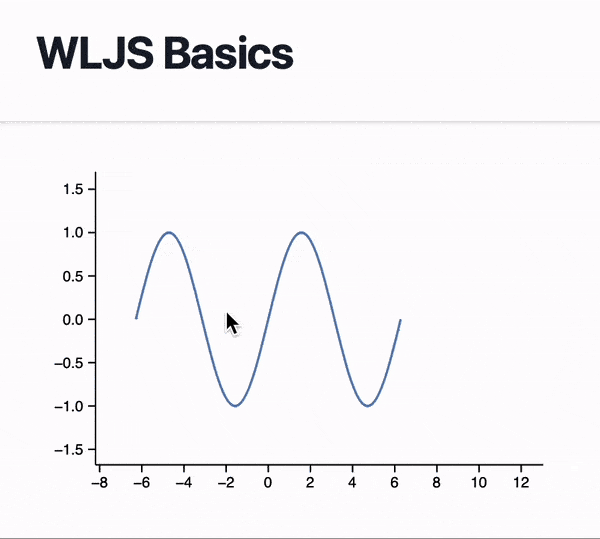

# Running WL in a browser

There is a set of JS and WL libraries, which originally designed for WLJS Notebook project. It comes with a tiny [Wolfram Language interpreter written in Javascript](https://github.com/JerryI/wljs-interpreter). It covers most needs in small numeric calculations, plotting and dynamics. To unlock full potential see [dynamics](WLX/dynamics.md) section.


<details>  
<summary>A shortcut</summary>  
If you have git installed. Simply clone 

```bash
git clone https://github.com/JerryI/wl-wlx
cd wl-wlx
wolframscript -f Examples/WLJSBasic/WLJSBasic.wls
```

that will run the simplest example possible
</details>


## Preparations

:::warning
The packages used in this tutorial cannot be downloaded using native Wolfram Paclet manager. Please consider to use [LPM](https://github.com/JerryI/wl-localpackages) 

```mathematica
Get["https://raw.githubusercontent.com/JerryI/wl-localpackages/main/Kernel/LPM.wl"]
(* or just download this will and add it to your project *)
```

:::

In order to scope all libraries to your project and provide paths to necessary CSS tables and Javascript files we need to add a couple of libraries

```mathematica
(* LPM Autoinstall and cache *)
Uncompress["1:eJx1T8tuwjAQDBT1wo0/6Ac0vveKKAoNCJoDZ5NugsXGtrwbBf6edawKLlzG+5rxzMfJ/TZvWZbRVKBomkms5wLfBmF1NcR0qN6lL/fbfMC0j4Q18
PM80mkmcDR8TlexK0Ug7SKnAh5f9F0aRoGi8y5wVUp5Zvb0pVTQQ96KTn/qCULtLIPlvHad2kAIt0IN+Imu1uh1fdEtkOq0seoHggVUydForuJgbJsCLgSWTj7r7d/q6gMQGWfT
Lt7KLPp4ZPq3+qz0Iv6Yddcj3gGoDVPG"];

PacletRepositories[{
  Github -> "https://github.com/KirillBelovTest/Objects",
  Github -> "https://github.com/KirillBelovTest/Internal",
  Github -> "https://github.com/JerryI/CSocketListener" -> "dev2024",
  Github -> "https://github.com/KirillBelovTest/TCPServer",
  Github -> "https://github.com/KirillBelovTest/HTTPHandler",
  Github -> "https://github.com/JerryI/wl-wlx",
  { /* highlight-next-line */ }
  Github -> "https://github.com/JerryI/wl-wljs-packages"
}]
```

The last line added is a package manager used by WLJS Notebook (*yet another package manager*), but comes handy here as well.

Then a few more modifications (*code continues*)

```mathematica

<<KirillBelov`Objects`
<<KirillBelov`Internal`
<<KirillBelov`CSockets`
<<KirillBelov`TCPServer`

<<KirillBelov`HTTPHandler`
<<KirillBelov`HTTPHandler`Extensions`

{ /* highlight-next-line */ }
<<JerryI`WLJSPM`

{ /* highlight-start */ }
WLJS`PM`Repositories[{
  Github -> "https://github.com/JerryI/wljs-interpreter" -> "dev",
  Github -> "https://github.com/JerryI/wljs-sharedlib-d3" -> "master",
  Github -> "https://github.com/JerryI/wljs-graphics-d3" -> "dev"
}]
{ /* highlight-end */ }

<<JerryI`WLX`
<<JerryI`WLX`Imported`
{ /* highlight-next-line */ }
<<JerryI`WLX`WLJS`
```

The first two links highlighted are 
- [wljs-interpreter](https://github.com/JerryI/wljs-interpreter) an interpreter of WL running on Javascript engine
- [wljs-graphics-d3](https://github.com/JerryI/wljs-graphics-d3) 2D graphics library

There are more libraries available...
- [wljs-plotly](https://github.com/JerryI/wljs-plotly) Alternative 2D plots using Plotly.js
- [wljs-inputs](https://github.com/JerryI/wljs-inputs) a GUI elements like buttons, slides and etc (see in section [dynamics](WLX/dynamics.md))
- [wljs-graphics3d-threejs](https://github.com/JerryI/Mathematica-ThreeJS-graphics-engine) 3D graphics


:::note
Those libraries are borrowed from WLJS Notebooks
:::

The last few things concerns about HTTP server settings (*code continues*)

```mathematica
Print["Staring HTTP server..."];

tcp = TCPServer[];
tcp["CompleteHandler", "HTTP"] = HTTPPacketQ -> HTTPPacketLength;
tcp["MessageHandler", "HTTP"] = HTTPPacketQ -> http;


index := ImportComponent["Components/Index.wlx"];

http = HTTPHandler[];

{ /* highlight-start */ }
http["MessageHandler", "File"]  = GetFileRequestQ[{"css", "js"}] -> (
  ImportFile[#, "Base" -> {"wljs_packages"}] &
)
{ /* highlight-end */ }

http["MessageHandler", "Index"] = AssocMatchQ[<|"Method" -> "GET"|>] -> Function[x, index[x]]

(* ::End::*)
SocketListen[CSocketOpen["127.0.0.1:8010"], tcp@# &];

(* import wljs-libs data *)
{ /* highlight-start */ }
Map[Function[path,
    Block[{System`$RemotePackageDirectory = FileNameJoin[{"wljs_packages", FileNameSplit[path] // First}]},
        FileNameJoin[{"wljs_packages", path}] // Get // Quiet;
    ];
], WLJS`PM`Includes["kernel"] ];
{ /* highlight-end */ }

"open http://127.0.0.1:8010" // Print;
While[True, Pause[1];];
```

The highlighted lines are for resolving URLs pointing to above-mentioned libraries and imports inner Wolfram Language packages.

## Page design
Now a boilerplate code as we have seen in the previous sections

```jsx title="Components/Index.wlx"
Main := ImportComponent["Main.wlx"];

<Main Request={$FirstChild}/>
```

:::note
In principle you don't have to use this intermediate `Index.wlx` file and import directly `Main.wlx`. However here it forces WLX importer to perform parsing for every request, so that one can observe changes without restarting Wolfram Kernel.
:::

Now our entry-point component

```jsx title="Components/Main.wlx"
(* /* HTML Page */ *)

{ /* highlight-start */ }
ExtensionsJS = (FileNameToURLPath[#]) &/@ WLJS`PM`Includes["js"];
ExtensionsStyles = With[{Path = FileNameToURLPath[#]},
  <link rel="stylesheet" href="{Path}"/> 
] &/@ WLJS`PM`Includes["styles"] // ToStringRiffle;
{ /* highlight-end */ }

App = ImportComponent["App.wlx"];

<html> 
    <head>
        <title>WLX Template</title>
        <link href="https://unpkg.com/tailwindcss@^1.0/dist/tailwind.min.css" rel="stylesheet"/>   
        { /* highlight-start */ }    
        <WLJSHeader List={ExtensionsJS}/> 
        <ExtensionsStyles/>     
        { /* highlight-end */ }     
    </head>  
    <body> 
        <div class="min-h-full">
            <header class="bg-white shadow">
                <div class="flex items-center mx-auto max-w-7xl px-4 py-6 sm:px-6 lg:px-8">
                    <h1 class="text-3xl font-bold tracking-tight text-gray-900">WLJS Basics</h1>
                </div>
            </header>
            <main>
                <App/>
            </main>
        </div>
    </body>
</html
```

Those lines are for embedding necessary Javascript and CSS tables to the head element of our page, which will be imported by server from our *wljs libraries*.

Now everything is set, we can move on to the main part.

## Usage
An access to the interpreter can be done by wrapping Wolfram Expressions via special tag or function

```jsx title="Components/App.wlx"
P = Plot[Sin[x], {x, -2Pi, 2Pi}];

<div class="mx-auto max-w-7xl py-6 sm:px-6 lg:px-8">
    <WLJS><P/></WLJS>
</div>
```

or

```jsx title="Components/App.wlx"
P = Plot[Sin[x], {x, -2Pi, 2Pi}] // WLJS;

<div class="mx-auto max-w-7xl py-6 sm:px-6 lg:px-8">
    <P/>
</div>
```


<div style={{"text-align": "center"}}>



</div>


What it does it exports the result of the evaluation to `ExpressionJSON` and embeds it to the page, where the tag is located. Lately when the page is loaded, a javascript code will be executed. If there is any graphics output presented it will embed it directly to the `<div>` element. 

:::note
Most 2D plotting functions of Mathematica are covered, as well as 3D, but with some limitations. Please consider the [reference section](https://jerryi.github.io/wljs-docs/docs/frontend/instruction/#) on those libraries.
:::

## Styling
One can pass any class names (from CSS table) to `<WLJS>` tag to customize the output

```jsx
<style>
	.myClass {
		position:absolute;
		top: 0;
		left: 0;
		right: 0;
		bottom: 0;
		margin: auto;
	}
</style>

<WLJS Class={"myClass"}><P/></WLJS>
```
## Inputs, buttons, UI...?
To __use GUI element__ as etc., please have a look @ [dynamics](WLX/dynamics.md) section.

## A note on Javascript functions
This is covered by [WLJS Interpreter](https://jerryi.github.io/wljs-docs/docs/interpreter/intro), however the general idea is, that any symbol with own- or down- values is represented as

```jsx
<script type="module">
core.MyFunction = async (args, env) => {
	const data = await interpretate(args[0], env);
	element.innerHTML = data;
}
</script>
```

try to embed the following symbol onto a page

```jsx
Test = MyFunction["Hello World!"];

<WLJS><Test/></WLJS
```

or if you use XML attributes

```js
<script type="module">
core.MyFunction = async (args, env) => {
	const data = await core._getRules(args, env);
	console.log(data);
}
</script>
```

and

```jsx
<WLJS><MyFunction Data={"Hello World"}/></WLJS
```

check the browser's console.

There are much more to cover on this topic. __Please consider to read the original docs on WLJS Interpreter__.

